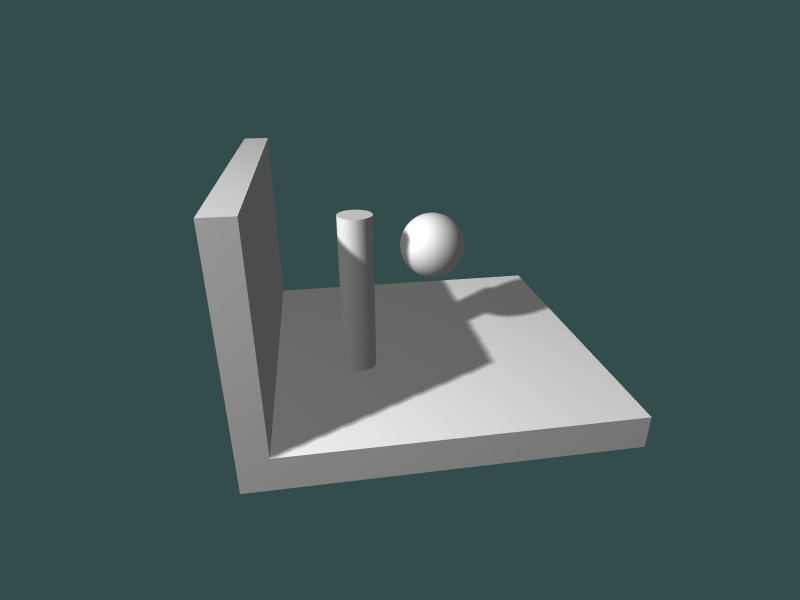

# Shadow Mapping in OpenGL

An OpenGL C++ implementation of basic shadow mapping using a depth buffer.
    

Implements a two pass rendering algorithm, as described in "Casting Curved Shadows on Curved Surfaces" by Lance Williams, 1978.

## How to run

* Only tested on Linux. You may need to do some Windows-specific modifications to compile the project there. 
* Required libraries:
    * `GL`
    * `GLFW3`
    * `GLEW`
    * `GLM`
    * `ASSIMP`
* Use `cmake` to build the project: `cmake -G "CodeBlocks - Unix Makefiles" /path/to/shadows`
* Run the output executable `shadows`

## Usage

* Left click and drag mouse to move the camera around
* Use `W`/`S`/`A`/`D`/`UP`/`DOWN` keys to move the camera forward, horizontally and vertically respectively
* Scroll mouse to zoom
* Press `r` to reset the camera
* `q` to quit

## References
1. [Casting Curved Shadows on Curved Surfaces](https://dl.acm.org/doi/10.1145/280811.280975), Williams, 1978
2. [OpenGL Tutorial](http://www.opengl-tutorial.org/intermediate-tutorials/tutorial-16-shadow-mapping/)
3. [LearnOpenGL](https://learnopengl.com/Advanced-Lighting/Shadows/Shadow-Mapping)
