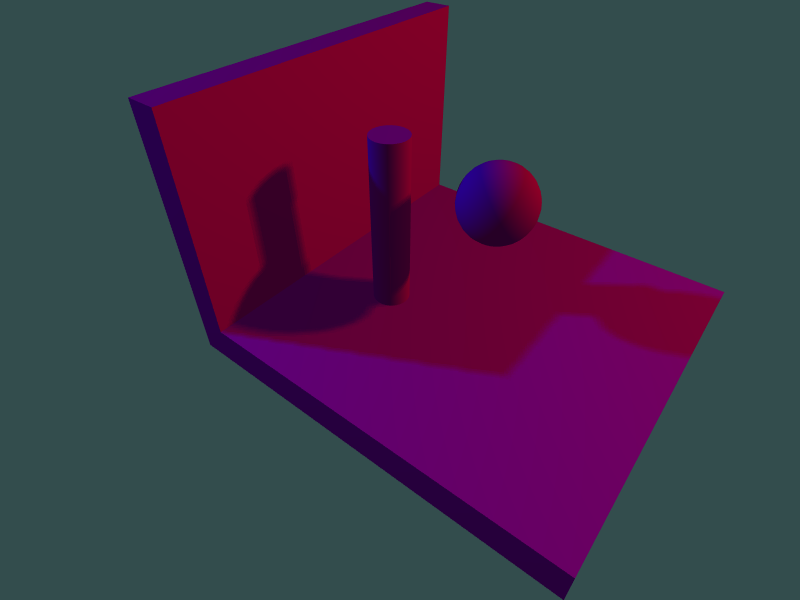
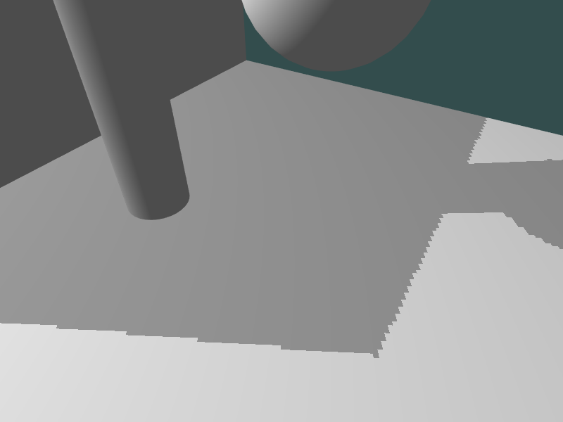

# Shadow Mapping in OpenGL

An OpenGL C++ implementation of basic shadow mapping using a depth buffer.
    

Implements a two pass rendering algorithm, as described in "Casting Curved Shadows on Curved Surfaces" by Lance Williams, 1978.

## How to run

* Only tested on Linux. You may need to do some Windows-specific modifications to compile the project there. 
* Required libraries:
    * `GL`
    * `GLFW3`
    * `GLEW`
    * `GLM`
    * `ASSIMP`
* Use `cmake` to build the project: `cmake -G "CodeBlocks - Unix Makefiles" /path/to/shadows`
* Run the output executable `shadows`

## Usage

* Left click and drag mouse to move the camera around
* Use `W`/`S`/`A`/`D`/`UP`/`DOWN` keys to move the camera forward, horizontally and vertically respectively
* Scroll mouse to zoom
* Press `r` to reset the camera
* `q` to quit
* `m` to toggle depth minimap(s)
* Use `1`..`9` to toggle the corresponding light

## Algorithm Discussion

There are two main steps involved in the algorithm. First step, involves creating the shadow map, which takes one pass for each light source. The second step is actually shading and rendering the scene according to the saved shadow maps.

### Creating the shadow map

Consider a single light source in the scene. We create the rendering of the scene from the point of view of this light source. This scene is stored in a depth buffer/depth map as a texture, often called a shadow map, which contains all the visible points for this light. This step can be easily repeated for other light sources in the scene as well, creating separate shadow maps for each light.  

### Shading the scene

In the second step, the scene is rendered normally from the point of view of the camera. While doing this, each coordinate in the camera space representing a pixel in the rendered scene is transformed into the light space coordinate system. The resulting z coordinate (after perspective division) is then checked against the previously computed depth buffer value at this xy coordinate to determine if this point lies in the light or in shadow.

### Challenges

#### Shadow acne, aka self-shadowing

Following the original algorithm outlined in the paper, the results were as shown below.
    

Distinct patterns are visible on the surfaces, as an instance of the well known [Moiré pattern](https://en.wikipedia.org/wiki/Moir%C3%A9_pattern) phenomenon. In theory, the map stores the distance to the closest object from the light; however, due to finite nature of raster graphics, it stores the distances in discrete values. The rendered surfaces are not actually continuous, but rather have jagged texture, with some rows of pixels raised above their neighbours. This causes the surface to shadow *itself*, since the rows of raised pixels cast a small shadow onto their neighbours, forming bands as seen above.

**Solution:** By understanding that the acne occurs at the surfaces facing towards the light, we can mitigate shadow acne by inserting a small bias value in the depth map comparision calculation. This shifts the perceived depth of all pixels *below* the surface (away from the light), and the "raised" pixels cannot cast shadows anymore.

#### Peter panning

Adding a bias causes another problem, as shown below.
    

The objects look as if they are "hovering" above the ground, since we shifted the depths away from the light. This is called the "Peter Pan Effect", named after the character who was separated from his shadow. To remedy this, we have to make sure that the bias we use is small enough to not be noticeable. However, using a constant bias value in this case proves to be inadequate for removing acne on curved surfaces where some pixels may still become raised above the surface. 

**Solution:** The solution to both these problems is to use a small, but varying bias value dependent on the angle between the normals to the surface and the light direction.

#### Aliasing
Looking closely at the edges of the shadows, we see another problem.
    

The shadow edges are extremely jagged, as a consequence of the limited resolution of the depth map we use in the first pass.

**Solution:** There is a rich literature on solving this problem, and here we have implemented Poisson Sampling to reduce aliasing. In the second pass, instead of sampling the depth map only once for each pixel, it's neighbouring pixels in a small circular disc are also sampled. Their depth values also factor into the final visibility value of the pixel, thus allowing for a smooth output. 

### Results

The final output is shown below
    

* We have added support for multiple lights, to allow for more interesting scenarios

## References
1. [Casting Curved Shadows on Curved Surfaces](https://dl.acm.org/doi/10.1145/280811.280975), Williams, 1978
2. [OpenGL Tutorial](http://www.opengl-tutorial.org/intermediate-tutorials/tutorial-16-shadow-mapping/)
3. [LearnOpenGL](https://learnopengl.com/Advanced-Lighting/Shadows/Shadow-Mapping)
